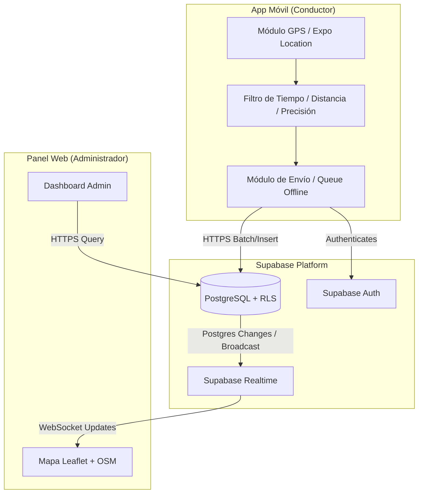

# Arquitectura del Sistema - MaquiTaxis

## 1. Visión General del Proyecto

MaquiTaxis es una plataforma para la gestión, monitoreo en tiempo real y seguimiento de recorridos de taxis (desde un solo vehículo hasta flotillas). 

El sistema consta de tres pilares principales:
1. **Aplicación Móvil (Conductores)**: Desarrollada en React Native / Expo con TypeScript. Encargada del inicio/fin de jornada, captura eficiente de GPS y envío de ubicaciones al backend.
2. **Panel Administrativo Web (Despachadores/Administradores)**: Desarrollado en React / Vite con TypeScript y Leaflet/OpenStreetMap. Permite monitorear taxis en tiempo real sobre un mapa, gestionar taxis/conductores y consultar el historial de recorridos.
3. **Backend y Base de Datos (Supabase)**: Backend Serverless sobre Supabase que provee Autenticación (Supabase Auth), PostgreSQL como BD relacional, Supabase Realtime para actualizaciones de mapa sin recarga y Row Level Security (RLS) para la protección estricta de datos.

---

## 2. Tecnologías Utilizadas

| Componente | Tecnología | Razón de Elección |
| :--- | :--- | :--- |
| **App Móvil** | React Native + Expo (TypeScript) | Desarrollo rápido multiplataforma, excelente integración con APIs nativas de GPS (expo-location / background location). |
| **Panel Web** | React + Vite (TypeScript) | Rendimiento ultrarrápido de construcción, tipado estricto y facilidad de integración con librerías de mapas. |
| **Mapas Web** | Leaflet + OpenStreetMap | Alternativa de código abierto, flexible, ligera y sin costos directos de API por consumo. |
| **Backend & BD** | Supabase (PostgreSQL, Auth, Realtime) | Elimina la necesidad de infraestructura propia de servidor (Node.js/Python), provee suscripciones websockets (Realtime) y RLS a nivel de base de datos. |

---

## 3. Estructura Recomendada del Proyecto

Para mantener el código limpio, modular y reutilizable sin sobreingeniería, se propone una estructura tipo **Monorepo liviano** o repositorio estructurado por carpetas independientes:

```text
maquitaxis/
├── apps/
│   ├── mobile/             # Aplicación Expo / React Native (Conductores)
│   │   ├── src/
│   │   │   ├── components/ # Componentes UI (Botones, Modales, Cards)
│   │   │   ├── services/   # Lógica GPS, Supabase Client, Sync Storage
│   │   │   ├── screens/    # Pantallas (Login, ShiftActive, DriverHome)
│   │   │   ├── hooks/      # Hooks personalizados (useLocation, useAuth)
│   │   │   ├── types/      # Interfaces y tipos de TypeScript
│   │   │   └── utils/      # Funciones auxiliares y formateadores
│   │   ├── app.json
│   │   └── package.json
│   │
│   └── web/                # Panel Administrativo React + Vite (Admins)
│       ├── src/
│       │   ├── components/ # Tabla de taxis, Controles de mapa, Modales
│       │   ├── pages/      # Dashboard, MapView, TaxiManagement, DriverManagement, History
│       │   ├── services/   # Supabase Client, Realtime Subscriptions
│       │   ├── hooks/      # Hooks (useRealtimeTaxis, useHistory)
│       │   ├── types/      # Tipos reutilizados / locales
│       │   └── utils/      # Formateadores de fecha, distancia, GeoJSON
│       ├── index.html
│       ├── vite.config.ts
│       └── package.json
│
├── packages/
│   └── shared/             # Tipos e Interfaces de TypeScript compartidas (Modelos DB, Enums, DTOs)
│       ├── src/
│       │   ├── types.ts
│       │   └── constants.ts
│       └── package.json
│
├── supabase/               # Configuraciones y migraciones de Supabase
│   ├── migrations/         # Archivos de migración SQL (Tablas, RLS, Funciones)
│   ├── seed.sql            # Datos semilla para pruebas
│   └── config.toml
│
├── docs/                   # Documentación técnica
│   ├── ARCHITECTURE.md
│   └── DECISIONS.md
│
├── .gitignore
├── README.md
└── package.json            # Workspaces de NPM/PNPM (opcional)
```

---

## 4. Comunicación entre Componentes



---

## 5. Flujos Principales del Sistema

### 5.1. Flujo de Autenticación
1. Usuario abre la App Móvil o Panel Web.
2. Ingresa credenciales (Email / Password).
3. Supabase Auth valida credenciales y retorna sesión JWT con el `user_id` y metadatos/rol.
4. El cliente (Móvil o Web) consulta el perfil en la tabla `profiles` para conocer el rol (`driver` o `admin`).
5. En la App Móvil, si es `driver`, se obtiene la asignación activa del taxi (`taxi_assignments`).

### 5.2. Flujo de Captura y Filtrado GPS (App Móvil)
1. Conductor presiona "Iniciar Seguimiento".
2. Se valida y solicita permiso de ubicación en primer plano y segundo plano (`background location`).
3. El motor GPS emite lecturas periódicas.
4. **Filtro Inteligente de Posición**:
   - **Precisión**: Rechazar lecturas con margen de error > 30 metros.
   - **Distancia**: Ignorar si el vehículo se movió menos de 10-15 metros desde el último punto guardado.
   - **Tiempo**: Forzar envío tras un tiempo máximo (ej. 30 segundos) incluso si no hay gran movimiento, para indicar liveness.
   - **Velocidad Improbable**: Descartar saltos GPS anómalos.
5. **Modo Offline**: Si no hay conexión de datos móviles, la posición se guarda localmente en `AsyncStorage`. Al recuperar red, se envía el lote (batch insert).

### 5.3. Flujo de Tiempo Real (Panel Administrativo Web)
1. El panel administrativo se suscribe al canal de Supabase Realtime para la tabla `taxi_locations` (o broadcast canal por taxi).
2. Cada vez que se inserta una nueva ubicación en PostgreSQL, Supabase dispara la notificación via WebSocket.
3. El panel actualiza el marcador del taxi en el mapa Leaflet de forma fluida (animando la transición entre coordenadas).

---

## 6. Estructura General de Datos (Preliminar)

Las entidades fundamentales identificadas a partir del contexto son:

1. **`profiles` / `users`**: Información extendida de los usuarios (Nombre, Teléfono, Rol: `admin` | `driver`).
2. **`taxis`**: Registro de vehículos (Placa, Modelo, Marca, Año, Estado actual: `disponible` | `en_servicio` | `fuera_de_servicio` | `sin_conexion`).
3. **`drivers`**: Información específica de los conductores (Licencia, Estado).
4. **`taxi_assignments`**: Asignación entre Conductor y Taxi (Fecha inicio, Fecha fin, Estado de asignación).
5. **`tracking_sessions` / `trips`**: Representa una jornada o sesión de seguimiento activa (Taxi ID, Driver ID, Inicio, Fin, Estado).
6. **`gps_positions` / `taxi_locations`**: Registro histórico de posiciones GPS (Session ID, Taxi ID, Latitud, Longitud, Velocidad, Dirección/Rumbo, Precisión, Timestamp).

---

## 7. Estrategia de Seguridad y RLS

- **Supabase Auth** centralizará el manejo de tokens JWT.
- **Row Level Security (RLS)** en PostgreSQL garantizará que:
  - **Conductores (`driver`)**: Solo puedan insertar posiciones GPS en sesiones activas asignadas a su propio usuario.
  - **Administradores (`admin`)**: Puedan leer y escribir en todas las tablas (`taxis`, `drivers`, `assignments`, `sessions`, `gps_positions`).
  - Ningún usuario anónimo o con rol no autorizado podrá leer ni alterar registros de ubicaciones ni taxis.

---

## 8. Estrategia de Despliegue y Variables de Entorno

- **Variables de Entorno necesarias (`.env`)**:
  - `SUPABASE_URL`: URL del proyecto Supabase.
  - `SUPABASE_ANON_KEY`: Clave pública anónima de Supabase.
  - (Nunca incluir `SUPABASE_SERVICE_ROLE_KEY` en clientes móviles o web).
- **Entornos**:
  - Desarrollo local con Supabase CLI.
  - Staging / Producción en Supabase Cloud.
  - Panel Web hospedado en plataformas estáticas (Vite build -> Vercel/Netlify/Cloudflare Pages).
  - App Móvil compilada mediante Expo Application Services (EAS Build) o APKs de desarrollo local.
